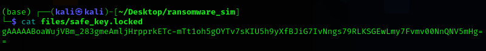

# 💀 WannaCry 2.0 - Educational Ransomware Simulator

> ⚠️ **FOR EDUCATIONAL PURPOSES ONLY**  
This project is a **safe, offline, non-malicious ransomware simulator** designed to demonstrate basic ransomware behavior.  
**DO NOT USE** in any real-world system or production environment.  
Violating laws with this code is **your responsibility**, not the author’s.

---

## 🎯 Objective

Simulate ransomware behavior:
- Encrypts user files using AES-based Fernet symmetric encryption
- Displays an unclosable GUI demanding a key for decryption
- Only the correct key (stored server-side) restores access to files

---

## 🧪 Features

| Feature                           | Status |
|-----------------------------------|--------|
| File encryption with Fernet AES   | ✅     |
| `.locked` file extension          | ✅     |
| Prevents double encryption        | ✅     |
| Detects and re-encrypts plaintext | ✅     |
| Custom GUI with ransom note       | ✅     |
| Blocks Alt+F4 / Close / Minimize  | ✅     |
| Input field for decryption key    | ✅     |
| Decryption with original key only | ✅     |
| Simulates a realistic ransomware  | ✅     |

---

## 🧰 Requirements

- Python 3.x  
- [cryptography](https://pypi.org/project/cryptography/)

### Install dependencies:

```bash
pip install cryptography
```

---

## 📁 Folder Structure

```
├── main.py            # Core ransomware simulator script
├── README.md          # This file
├── key.key            # Encryption key (autogenerated)
├── attacker_keys.txt  # Attacker's log of keys (auto-saved)
└── files/             # Target files to encrypt
```

---

## ⚙️ How It Works

1. On first run:
   - Generates a Fernet key
   - Encrypts all files inside the `files/` directory
   - Appends `.locked` extension to each
   - Displays a persistent GUI window

2. On later runs:
   - Detects if any file is in plaintext
   - Re-encrypts them if needed
   - Skips already-encrypted files

3. GUI remains always-on-top, cannot be closed/minimized/killed.

4. Entering the correct decryption key:
   - Restores original files
   - Renames `.locked` files back to original
   - Closes the GUI

---

## 🚀 Usage

### 1. Setup

```bash
# Create target directory with sample files
mkdir -p files
echo "TOP SECRET INTEL" > files/intel.txt
echo "DO NOT OPEN" > files/ops.txt
```

### 2. Run the simulator

```bash
python main.py
```

- Files will be encrypted and renamed with `.locked`
- GUI will appear demanding the key
- Pressing X or Ctrl+C won't work

### 3. Decrypt (Simulated Recovery)

- Check the key stored in `attacker_keys.txt`
- Paste it into the GUI
- Files will be restored

---

## 🧼 Clean Reset (For Testing)

```bash
rm -f key.key attacker_keys.txt
rm -rf files
mkdir files
echo "REDACTED" > files/new.txt
python main.py
```
## 📷 Screenshots

### 🔒 Encryption Activated


### 🧊 GUI Ransom Note Window


### 🔑 Key Entry Screen


### ✅ Successful Decryption


### 🔁 Re-encryption Simulation


---


## 🛡️ Disclaimer

This project is **strictly for educational and demonstration purposes** to:
- Understand how ransomware works
- Practice defensive programming
- Study file encryption and key handling

⚠️ Misusing this software may be illegal depending on your country.  
**Author is NOT responsible** for any misuse or damages caused.

---

## 🧠 Author Note

Crafted by a disciplined soldier on a mission to simulate cyber chaos without crossing legal lines.  
Stay sharp. Stay ethical. Stay in control.

---


>   
_Add a screenshot of the GUI here if desired._

---
